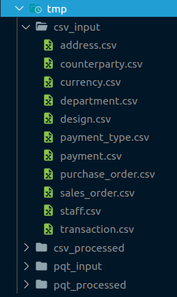
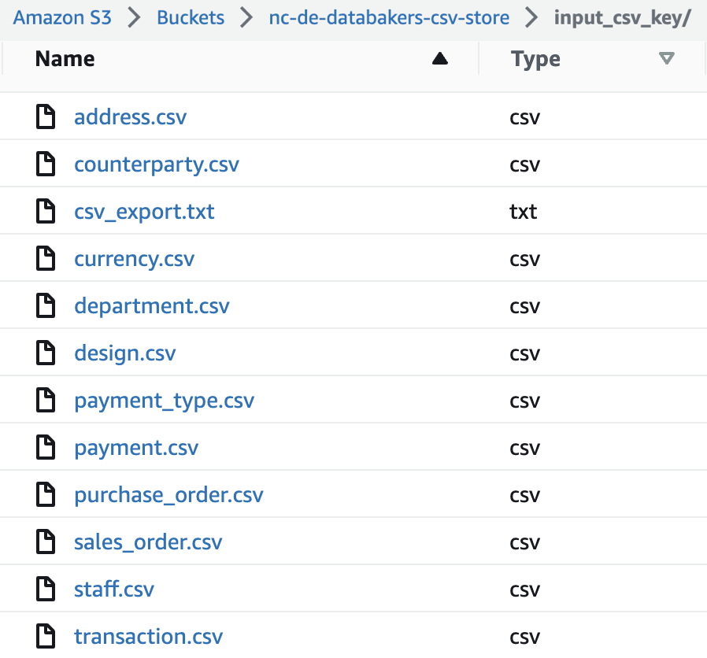

# **NC-DE-DataBakers**

Data Engineering Project - create applications that will Extract, Transform and Load (ETL) data from a prepared source into a data lake and warehouse hosted in AWS.

---

## **Prerequisites**

This is an example of how to list things you need to use the software and how to install them.

### AWS

Remember to set up your AWS credentials by running `aws configure` in your terminal.

Note: You can set the region and output format as _default_ by leaving the fields empty.
```python
aws configure
AWS Access Key ID [****************ABCD]:
# YOUR_ACCESS_KEY
AWS Secret Access Key [****************tr68]:
# YOUR_SECRET_KEY
```

### Setup Virtual Environment

*_**Ensure you have a supported version of Python installed.**_

Create and activate your virtual environment with the commands:

```python
python -m venv venv
source venv/bin/activate
```

### Installation

Once the virtual environment has been activated, run the following command to install the required packages:

```python
pip install -r requirements.txt
```

---

## **ETL**

The extractor_lambda, transformer_lambda and loader_lambda are used to automate the ETL process.

### Extractor Lambda

Using `pg8000`, a connection is made using credentials sourced from the AWS secrets manager.

The `extractor_lambda` extracts data from the ToteSys database, temporarily saving them to a local `tmp` directory as CSV files.  
With `boto3`, we can access the AWS console and load these files to the `input_csv_key` within the `csv-store` S3 bucket.  
Upon completion of loading the CSV files to the targeted key, a `csv_export.txt` file is generated and loaded, confirming success of data extraction.

<table>
<tr><th>Local tmp directory</th><th>AWS S3 bucket</th></tr>
<tr><td>

_Extracted from ToteSys database_



</td><td>

_Loaded from local tmp directory_



</td></tr> </table>

### Transformer Lambda

The `transformer_lambda` remodels the data into a star schema ready for conversion to parquet format.  
With `boto3`, the CSV files are moved from the `input_csv_key` and `processed_csv_key` within the `csv-store` S3 bucket hosted on AWS. These are then downloaded and temporarily stored in a local `tmp` directory.  
Utilising `pandas`, the CSV files are remodelled as required to create dimension tables and a fact table forming a star schema conforming to the warehouse data model.

_Example:_
<table>
<tr><th>staff</th><th>department</th><th>dim_staff</th></tr>
<tr><td>

|first_name|department_id|
|--|--|
|Jeremie|1|
|Deron|2|

</td><td>

|department_id|department_name|
|--|--|
|1|Sales|
|2|Purchasing|

</td><td>

|first_name|department_name|
|--|--|
|Jeremie|Sales|
|Deron|Purchasing|

</td></tr> </table>

These are then temporarily stored locally in `tmp/csv_processed` ready to be converted to parquet format and exported to the local `tmp/pqt_processed` directory. Once the conversion is complete, the parquet files are loaded into the `input_parquet_key` within the `parquet-store` S3 bucket.

### Loader Lambda

The `loader_lambda` loads.

## Testing

You can run the tests using `pytest` which, by default, will run all tests. To run individual tests, provide the path of the specfic test file.

Example:
```python
pytest tests/test_extractor_lambda.py
```

<!-- ## conn.py

Using `pg8000`, a connection is made using credentials sourced from AWS secrets manager, retreiving the stored database credentials.
Querys to the database, `SELECT table_name`, passing them to `lambda_handler()` where a new SQL query is made to `SELECT *` from each table provided. This data is saved to csv, and uploaded to the processing bucket hosted on aws s3.

Common errorhandling include:

Connection Errors - `InterfaceError:` - Typically a bad host name.  
Connection Errors - `DatabaseError: 28P01` - User/Password is incorrect.  
Connection Errors - `ProgrammingError: 28P01` - User/Password is incorrect.  
Connection Errors - `ProgrammingError: 3D000` - Database does not exist.  

Query Errors - `ProgrammingError: 42703` - Column does not exist.  
Query Errors - `ProgrammingError: 42P01` - Relation to table does not exist.

## s3_helper.py
Using boto3, we are able to access AWS directly. This enables us to upload files to the input key, within the CSV store bucket, by implementing Python logic.

Ensuring the setup_success_csv_input.txt file exists, indicates the terraform has been deployed succesfully. The CSV files generated (locally) from the lambda_handler() function can then be uploaded to the input key, within the CSV store bucket.

After completion of uploading the CSV files, a text file csv_export_completed.txt, containing the most recent run number is created and uploaded to the input key, within the CSV store bucket. The latest run number can be found in the run_number.txt file.

Common error-handling includes:
No buckets have been created - Error raised: 'No buckets found'
The CSV store bucket has not been created - Error raised: 'Prefix not found in any bucket'
Terraform has not been deployed - Error: 'Terraform deployment unsuccessful'

## csv_to_parquet.py
Connection to the s3 bucket, is made to parse a list of available buckets and their suffix's. once the correct bucket is found, itterating over each file to extract their name prior to downloading to a local './tmp' folder.
each file is converted from csv to parquet using the pandas library - pyarrow/fastparquet engine. and stored locally ready to to be sent to the parquet input bucket.

common error-handling include:
no data in CSV - pd.errors.EmptyDataError 
No files to convert - ValueError - 'ERROR: No CSV files to convert to parquet'
No bucket found - Value Error - "ERROR: No buckets found"
No bucket found - Value Error - "ERROR: Prefix not found in any bucket"

s3-pqt-processed-update-and-delete
No buckets have been created - Error raised: 'No buckets found'
The CSV store bucket has not been created - Error raised: 'Prefix not found in any bucket'
Terraform has not been deployed - Error: 'Terraform deployment unsuccessful'

## s3_processed_helper.py
Using boto3, we are able to access AWS directly. This enables us to upload the converted parquet files to the parquet input key, within the CSV store bucket, by implementing Python logic.

Ensuring the setup_success_csv_input.txt file exists, indicates the terraform has been deployed succesfully. The converted Parquet files saved (locally) can then be uploaded to the input key, within the Parquet store bucket.

After completion of uploading the Parquet files, a text file parquet_export_completed.txt, containing the most recent run number is created and uploaded to the input key, within the Parquet store bucket. The latest run number can be found in the run_number.txt file.

Thereafter, the CSVs from the csv bucket will be moved from input to processed and a log will be created and updated in the csv processed once the files are moved in.

Common error-handling includes:No buckets have been created - Error raised: 'No buckets found'
The CSV store bucket has not been created - Error raised: 'Prefix not found in any bucket'
The Parquet store bucket has not been created - Error raised: 'Prefix not found in any bucket'
Terraform has not been deployed - Error: 'Terraform deployment unsuccessful'

## s3_pqt_processed_helper.py
Using boto3, we are able to access AWS directly. After the star schema conversion and upload to the datastore has been completed, we will need to indicate which parquets have been processed. 

To show this, the Parquets from the parquet bucket will need to be moved from input to processed and a log will be created and updated in the parquet_processed text file once the files are moved in.

Common error-handling includes:
No buckets have been created - Error raised: 'No buckets found'
The CSV store bucket has not been created - Error raised: 'Prefix not found in any bucket'
The Parquet store bucket has not been created - Error raised: 'Prefix not found in any bucket'
Terraform has not been deployed - Error: 'Terraform deployment unsuccessful' -->
