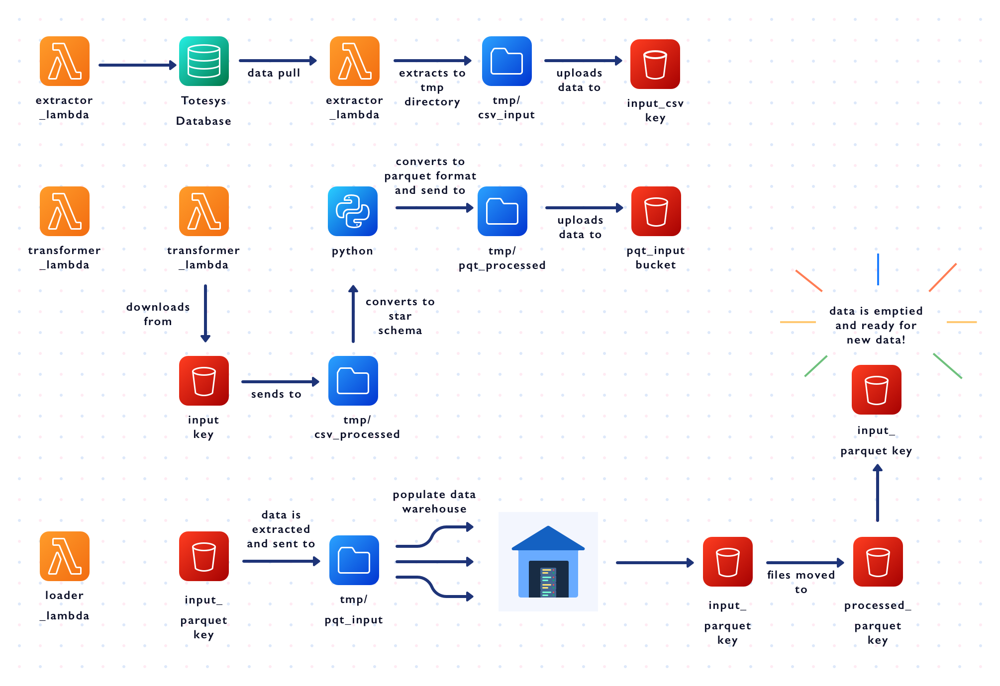

# **NC-DE-DataBakers**

## **Data Engineering Project**

Creating applications that will Extract, Transform and Load (ETL) data from a prepared source (ToteSys database) into a data lake and warehouse hosted in AWS.

---

## **Prerequisites**

Before running this software you will need to set up your environment as described below.

<br>

### AWS

Remember to set up your AWS credentials by running `aws configure` in your terminal.

Note: You can set the region and output format as _default_ by leaving the fields empty.

```python
aws configure
AWS Access Key ID [****************ABCD]:
# YOUR_ACCESS_KEY
AWS Secret Access Key [****************tr68]:
# YOUR_SECRET_KEY
```

<br>

### Setup Virtual Environment

*_**Ensure you have a supported version of Python installed.**_

Create and activate your virtual environment with the commands:

```python
python -m venv venv
source venv/bin/activate
```

<br>

### Installation

Once the virtual environment has been activated, run the following command to install the required packages:

```python
pip install -r requirements.txt
```

---

## **Terraform**

To deploy the terraform, make sure you are in the terraform directory and run the following commands in your terminal:

```python
terraform init
# Prepare the directory to use terraform

terraform plan
# Review the actions that will take place

terraform apply
# Deploy your terraform infrastructure
```

The following command will take down the terraform infrastructure:

```python
terraform destroy
# Destroy your terraform infrastructure
```

Credentials are stored and managed by the secrets manager to maintain confidentiality.

The event scheduler runs the `extractor_lambda` every 15 minutes to detect any new data. This then triggers the `transformer_lambda` and `loader_lamda` to run.

Cloudwatch monitor the progress and logs the activities. In the case where an error arises, SNS notifications is set up to alert you via email.

---

## **ETL**

The extractor_lambda, transformer_lambda and loader_lambda are used to automate the ETL process.



<br>

### Extractor Lambda

Using `pg8000`, a connection is made using credentials sourced from the AWS secrets manager.

The `extractor_lambda` extracts data from the ToteSys database and loads this to AWS. 

For each table in the ToteSys database, data is extracted using PSQL queries and temporarily saving them to a local `tmp/csv_input` directory as CSV files.  
With `boto3`, we can access the AWS console and load these files to the `input_csv_key` within the `csv-store` S3 bucket.

<table>
<tr><th>Local tmp directory</th><th>AWS S3 bucket</th></tr>
<tr><td>

_Extracted from ToteSys database_


</td><td>

_Loaded from local tmp directory_


</td></tr> </table>

Common error handling includes:

ConnectionErrors - `InterfaceError:` - Typically a bad host name.  
ConnectionErrors - `DatabaseError: 28P01` - User/Password is incorrect.  
ConnectionErrors - `ProgrammingError: 28P01` - User/Password is incorrect.  
ConnectionErrors - `ProgrammingError: 3D000` - Database does not exist.

QueryErrors - `ProgrammingError: 42703` - Column does not exist.  
QueryErrors - `ProgrammingError: 42P01` - Relation to table does not exist.

<br>

### Transformer Lambda

The `transformer_lambda` remodels the data into a star schema ready for conversion to parquet format.

With `boto3`, the CSV files are moved from the `input_csv_key` and `processed_csv_key` within the `csv-store` S3 bucket hosted on AWS.  
These are then downloaded from the `processed_csv_key` and temporarily stored in a local `tmp/csv_processed` directory.  
Utilising `pandas`, the CSV files are remodelled as required to create dimension tables and a fact table forming a star schema conforming to the warehouse data model.

_Example:
Using `pandas`, the `staff` and `department` dataframes are merged on a correlation of column such as `department_id`. The `dim_staff` dataframe is created from the merged dataframe and saved to the local `tmp/csv_processed` as a CSV file._
<table>
<tr><th>staff</th><th>department</th><th>dim_staff</th></tr>
<tr><td>

|first_name|department_id|
|--|--|
|Jeremie|1|
|Deron|2|

</td><td>

|department_id|department_name|
|--|--|
|1|Sales|
|2|Purchasing|

</td><td>

|first_name|department_name|
|--|--|
|Jeremie|Sales|
|Deron|Purchasing|

</td></tr> </table>

These new tables are then temporarily stored locally in `tmp/csv_processed` ready to be converted to parquet format and exported to the local `tmp/pqt_processed` directory.  
Once the conversion is complete, the parquet files are loaded into the `input_parquet_key` within the `parquet-store` S3 bucket.

Common error handling includes:

ValueError - `pd.errors.EmptyDataError` - Files exist but are empty.  
ValueError - `pd.errors.DtypeWarning` - Column data mismatch.

<br>

### Loader Lambda

The `loader_lambda` populates the tables in the data warehouse with data from the parquet files.

With `boto3`, the parquet files are downloaded from the `input_parquet_key` and temporarily stored locally in `tmp/pqt_input`.  
Connecting to the data warehouse with `pg8000`, `pandas` is used to populate the data warehouse with data from the downloaded parquet files.  
The parquet files within the `input_parquet_key` are then moved to the `processed_parquet_key` before emptying the `input_parquet_key` ready for new data.

<br>

## Testing

You can run the tests using `pytest` which, by default, will run all tests for the lambda handlers. To run individual tests, provide the path of the specfic test file.

Example:
```python
pytest tests/<file_path>
```

<br>

## Compliance Checks

Complying with the PEP8 style guide, all Python codes are automatically formatted by running the command:

```python
autopep8 <file_path>

# Flags are optional to determine aggressiveness or list potential fixes
# autopep8 <file_path> --in-place -a
# autopep8 <file_path> --in-place -a -a
# autopep8 <file_path> --list-fixes
```

To test for security vulnerabilities, the `safety` and `bandit` packages can be utilised by running the commands:

```console
safety check
bandit -lll <file_path>
```
